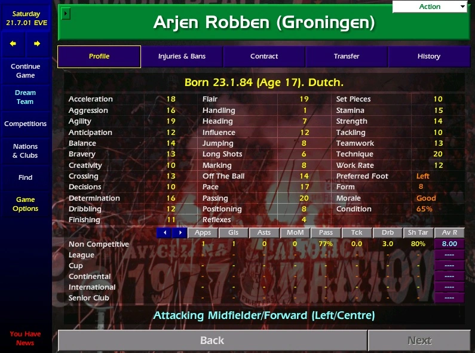
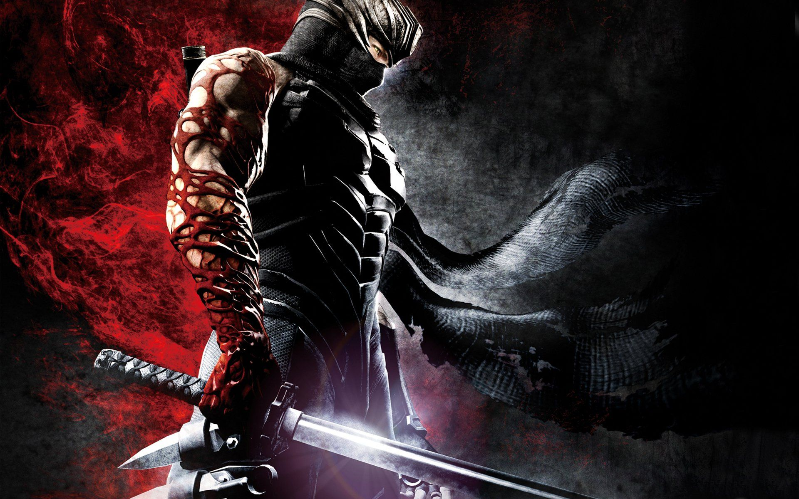
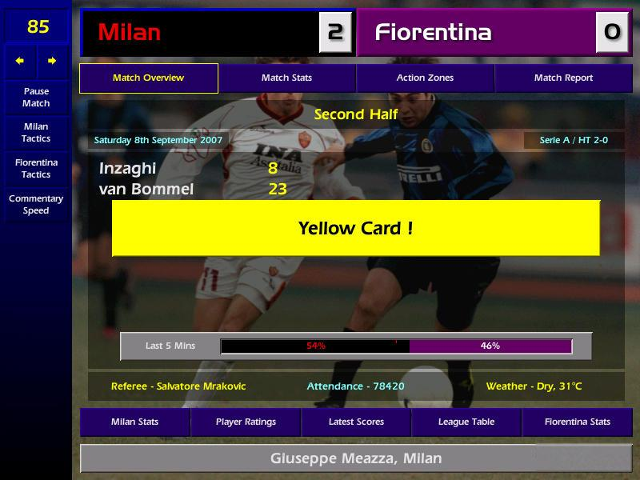

# Ninja Clan Manager
A game inspired by Championship Manager 01/02 & [Shogun 2 Ninja Assassination cutscenes](https://www.youtube.com/watch?v=Y1nqc7ZSjOM).

Character templates will look like this:

Color theme will be generated from this image:

Template match UI will be this:

---
## DISCLAIMER

I have no clue what I'm doing. :)
Feel free to throw advice at me.
This is the first time I ever tried to make a game or build anything in public.

I love Ninja games and movies, so expect a bit to flow in from multiple games.
Including maybe some things from the Hitman series.

I have no idea how to do graphics or 3D, that's why this first version will be a browser-based text-game.

---
## Initial Assumptions

This project is intended as a proof-of-concept.

The game will use local storage to store the game state & generate a local database.
The database will be auto-generated when starting the game based on a template of characters.

### Consideration during development

* Consider using Firebase for free S3 database storage
* Consider using redux with local storage persistence

---
## Mission Simulation Engine

Attribute-based rolls will use calculations inspired from the [footballSimulationEngine](https://github.com/GallagherAiden/footballSimulationEngine)

Will use the Ninja cutscenes to generate a few stories and infer required attributes along with decision making.
By the look of the cutscenes, they use two basic attributes from the game Shogun 2: Subterfuge & Evasion.
The cutscenes are composed on-the-fly based on roll checks.

Subterfuge is be used to run stealth-rolls as well as assassination-rolls.

Depending on the compound size & level, these will be first run forward, for infiltration and in reverse for exfiltration.
Later implementations could allow for luck or planning based rolls to make infiltration or escape easier.

i.e.: 
**Attempt to sneak into the compound.**
| Compound security rating | Compound apprehension rating | Ninja Subterfuge | Ninja Evasion |
| :-: | :-: | :-: | :-: |
| 12 | 7 | 10 | 7 |

- Compound Rolls Security 1-12: 7
- Ninja Rolls Subterfuge 1-10:  8

**Outcome:**

*Ninja passes the roll check and proceeds to the next scene.*

If the ninja fails the stealth check, an automatic check is rolled against the evasion skill

- Compound Rolls Apprehension 1-7: 3
- Ninja Rolls Evasion 1-7: 2

**Outcome:**

*Ninja gets caught and executed.*

---

## Gameplay

The player gets a simple text-based UI from which to control the clan, akin the one in CM01/02 with [black, white & red color theme](https://www.materialpalette.com/red/red).

The game starts with a high-level Ninja mission (where all rolls are successful).
The master ninja completes the greatest mission of all times.
He is rewarded by the local daimyo with 5000 koku and is released from service.
The reward is used the reward to set up a [Sake Den](https://shogun2-encyclopedia.com/buildings/sho_stealth_1_sake_den.html) as a secret Ninja School and base of operations.

The master Ninja acts as the first teacher & headmaster of the school.
Every season, a number of orphans from the region will be arriving at the school to embark on their journey.

Money is earned through the sake den, by brokering information, fulfilling ninja missions and basic tavern services.

Mission reward is to be negotiated by the master ninja before accepting.
Negotiation, Determination & Influence skill will determine how much extra koku may be earned for the mission.

Some missions risk death, some capture.
A captured ninja can choose to return or defect. This is determined by his loyalty perk & relationship with the headmaster.

The sake den earns money based on the number of seats, decor, tavern keeper & waiter.
The game ends when the school goes bankrupt.

## Basic Concept

You start the game killing some guy, get tons of cash.
There'll be orphans, as consequence of your actions, and homeless folk (i.e.: the wives & children of the guards)

If you triggered a war between rivalling daimyos, there'd be even more deaths and as a consequence more orphans.
Most orphans will die and some will be found by your spies (beggars, prostitutes, tavern keepers, bought officials, etc)

Once brought to you, you get to choose which ones you keep and which ones you leave to their fate.
Your ability to spot current ability & potential ability should influence your decisions (accuracy dependend on your headmasters or teacher's skill)

Even if you'd like to keep all, it will affect your ability to feed your current roster.
If you take on too many, all will starve and you lose the game.

The larger the school, the more orphans you can have.

The game is over when your headmaster dies of old age, is assassinated by a rival clan or died in a successful assault on your school,
betrayed by someone close to you or... well any other number of reasons

Focus should be on expanding influence & control across japan (placing spies, adding dens, etc)

In effect, you sorta won the game when you are the puppet-master in the shadows,
ruling over the Japan, but there is no victory condition, so you can keep going as long as you want.

### Jobs to be filled

Tavern Keeper & waiters, Ninjutsu Teacher, Groundskeeper.
Hiring is done by posting ads and candidates replying or can be filled with students later on.

#### Waiter
Waiter affects revenue through influence, determination & negotiation skill.
A waiter may at times generate leads, which can be used to go on missions or sold for profit.
The value and interval of the leads will depend on the waiter's decision & influence skills.

#### Groundskeeper

Groundskeeper will be in charge of upgrading & maintaining the sake den & the ninja school yard.
The cost of renovation & upgrades will be determined by the groundskeepers negotiation, decision & determination skills.
The frequency & cost of issues that require repairs is determined by the groundskeepers decision, determination, anticipation & creativity skills.

#### Ninjutsu Teachers
Ninjutsu teachers will train the new students in the art of assassination.

| Teacher Skill | Affected Student Attributes |
| :-- | :-- |
| Subterfuge | stealth, assassination, pickpocketing, lockpicking, anticipation |
| Fitness | strength, stamina, reflexes, pace, acceleration |
| Grace | agility, balance, precision |
| Combat | aggression, hand-to-hand combat, shuriken toss |
| Chemistry | poison brewing, medicine |
| Scouting | decision, creativity, positioning, scouting, anticipation |
| Trapping | creativity, positioning, trap making, anticipation |

In addition, they have personality based attributes, which will affect the students related attributes:
Determination, Creativity, Decisions, Work Rate, Aggression, Anticipation, Influence

Teachers will have a random point allocation for their skill based on their specialization:
| Teacher Specialization | Point distribution favors attributes in |
| :-- | :-- |
| Shadow | Subterfuge, Grace, Scouting |
| Toxin Expert | Chemistry, Trapping, Subterfuge |
| Trapper | Trapping, Scouting, Chemistry |
| Tiger | Combat, Fitness, Grace |
| Spy | Scouting, Grace, Chemistry |

#### Ninja
Personal attributes
* Determination
* Creativity
* Decisions
* Work Rate
* Aggression
* Anticipation
* Influence

Ninja attributes
    
1. Physical
    * strength
    * stamina
    * reflexes
    * pace
    * acceleration
    * agility
    * balance
    * precision
1. Combat
    * hand-to-hand
    * shuriken toss
1. Subterfuge
    * stealth
    * assassination
    * pickpocketing
    * lockpicking
    * poison
    * medicine
    * trap making
1. Mental
    * aggression
    * anticipation
    * decision
    * creativity
    * positioning
    * scouting
    * negotiation
    * influence

### Backstories

Characters have backstories

* Tavern Keeper has gambling debt and needs more cash (higher upkeep)
* Groundskeeper is a buddhist and fasts a lot (lower upkeep)

### Race for contracts against rival clan

Later iterations could have rival clans bidding on the same contract and only the winning clan gets the reward.
If both ninjas reach the same area in about the same time

## Progress so far

[v] Create attribute table & types for ninja & guards
[v] Create character generator for ninja & guards
[v] Faked a rudimentary mission engine, that generates outcomes based on Ninja Stats & Guard stats
    Ideas that came up in the process:
    - Ninja has too many chances to fail, consider some cheating mechanism that gives the ninja an edge, but doesn't seem overpowered
    - Ninjas fight dirty. So cheating is not only permitted, but encouraged!
    - consider using some AI that better utilizes the large palette of skills
[v] Implemented a basic message queue which narrates the mission progress in a readable way
    Ideas that came up in the process:
    - consider using some AI to generate the narrative
    - research how text generator AIs can be included in the project
[v] Defined color theme
[v] Added font & icons
[v] Added sidebar
[v] Style the mission UI with Tailwind CSS to resemble Championship Manager 01/02
[v] Connect stub UI with mission engine
[v] Calculate mission outcome from message queue

## Current Step

[v] Add Japanese name generator
    -> had to create one, couldn't find a reliable npm module
    -> snatched names from multiple generator sites
    -> **consider exporting to own library**
[v] Update Ninja type to separate attributes from other information
[ ] Show Ninja attributes in the Ninjas tab

## UI Progression

### Day 2

End of day

### Day 3

Start of day 

Middle of day 3

End of day 3

